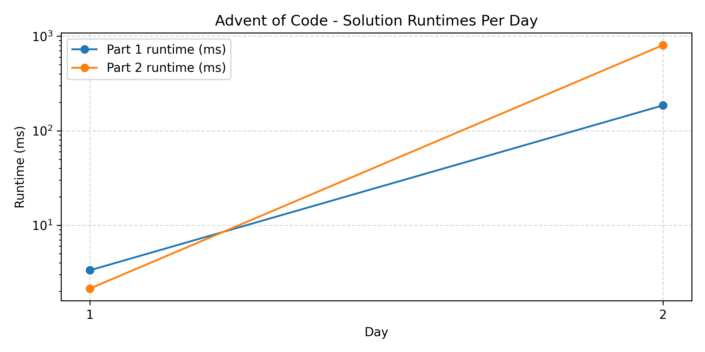

# Advent of Code

My repository for solutions to the yearly [Advent of Code](https://adventofcode.com/).
I will try to allocate time to create solutions for each day, but may
not be able to complete each puzzle daily. I am not competing for any
fancy scores, but will generally try to write good code. If you see
any bad practices, then feel free to reach out and mention those to me.

My ambitions for each year are:

- Attempt to solve the puzzle the day it is posted, otherwise at latest 48 hours after.
- Use a maximum of 1 hour per day on each puzzle, except on weekends.

These ambitions are meant to keep me grounded, and to make sure that I
do not over-engineer solutions nor waste too much time of my weekdays.

## 2021

My chosen language of 2021 was C#.

I failed to really get into the challenges before the mid of the month,
where my motion to actively try had deteriorated significantly.

## 2022

My chosen language of 2022 was Python.

It started off decent, but I quickly got too busy with studies to continue. For future years, I have to be able to accept doing them a day or so late.

## 2023

My chosen language of 2023 is Haskell.

I have for a long time wanted to delve more into Haskell, and so I am going to practice it alongisde doing Advent of Code.

## 2025

My chosen language of 2025 is Rust.

<!-- CSV_TABLE_MARKER -->
<!-- START CSV TABLE -->
| Day                         | Part 1 Runtime   | Part 2 Runtime   |
|:----------------------------|:-----------------|:-----------------|
| [1](2025/day01/src/main.rs) | 3.340542ms       | 2.141500ms       |
| [2](2025/day02/src/main.rs) | 185.548583ms     | 806.102792ms     |
<!-- END CSV TABLE -->

 
